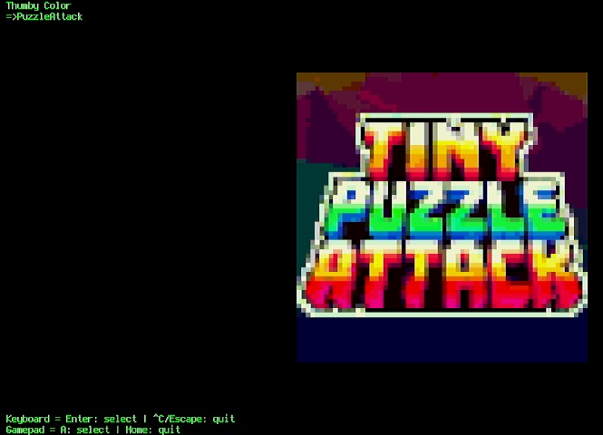

# Thumby Color Emulator for the Adafruit Fruit Jam
Translates the [TinyCircuits Thumby Color](https://tinycircuits.com/products/thumby-color) [engine API](https://color.thumby.us/doc/landing.html) into CircuitPython for use with the [Adafruit Fruit Jam](https://www.adafruit.com/product/6200).



## Controls

All controls are mapped for compatibility with the Thumby Color. Currently, USB boot keyboards and [various gamepads](https://circuitpython-usb-host-gamepad.readthedocs.io/) are supported.

| Thumby / Action | Gamepad | Keyboard |
|--------|---------|----------|
| D-Pad | D-Pad / Left Joystick | Arrow keys / WASD |
| A | A | J / Z |
| B | B | K / X |
| LB | L1 | Q / C |
| RB | R1 | E / V |
| MENU | Start | Enter |
| Reload or exit to [Fruit Jam OS](https://github.com/adafruit/Fruit-Jam-OS) | Home | Escape |

## Compatibility List

| Game | Status |
|------|------------|
| PuzzleAttack | ⚠️ _Playable, saves not working_ |

### Excluded Applications

The following applications are excluded from this package:

| Game | Reason |
|------|--------|
| 2048 | ❌ _Requires `mem_info`_ |
| 4Connect | ❌ _Requires `engine_nodes.PhysicsRectangle2DNode`_ |
| BadApple | ❌ _Micropython incompatibility_ |
| BustAThumb | ❌ _Micropython incompatibility_ |
| Chess | ❌ _Requires `engine_nodes.Line2DNode_ |
| Clouds | ❌ _Micropython incompatibility_ |
| ComboPool | ❌ _Requires `engine_nodes.PhysicsRectangle2DNode`_ |
| Demos | 🛑 _Not planned_ |
| FloodLight | 🛑 _Hardware incompatibility_ |
| FroggyRoad | ❌ _Texture rendering issue_ |
| Magic8Ball | ❌ _Requires `micropython.mem_info`_ |
| Monstra | ❌ _Requires `time.ticks_ms`_ |
| Sand | ❌ _Micropython decorator incompatibility_ |
| Screensaver | 🛑 _Not planned_ |
| Solitaire | ❌ _Micropython incompatibility, `super().__init__(self, ...`_ |
| SongOfMorus | 🛑 _Requires 3D rendering_ |
| Tagged | ❌ _Micropython decorator incompatibility_ |
| Tetrumb | ❌ _Requires `framebuf`_ |
| ThumbAtro | ❌ _Micropython incompatibility, `super().__init__(self, ...`_ |
| ThumbSweeper | ❌ _Requires `framebuf`_ |
| Thumgeon_II | ❌ _Requires `engine_physics`_ |
| Utilities | 🛑 _Hardware incompatibility_ |
| WallRacerC | ❌ _Requires `framebuf`_ |

## Building
Ensure that you have python 3.x installed system-wide and all the prerequisite libraries installed using the following command:

``` shell
pip install circup requests
```

Download all CircuitPython libraries and package the application using the following command:

``` shell
python build/build.py
```

The project bundle should be found within `./dist` as a `.zip` file with the same name as your repository.
